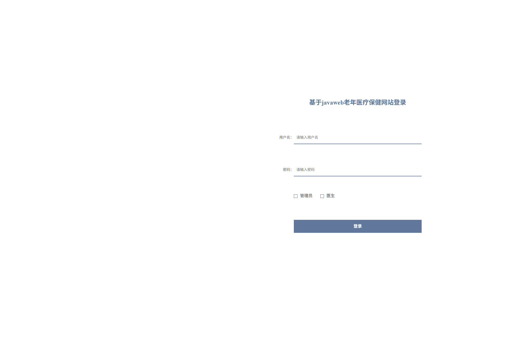
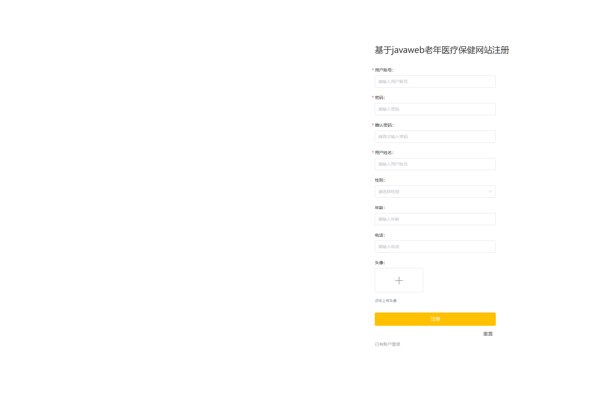
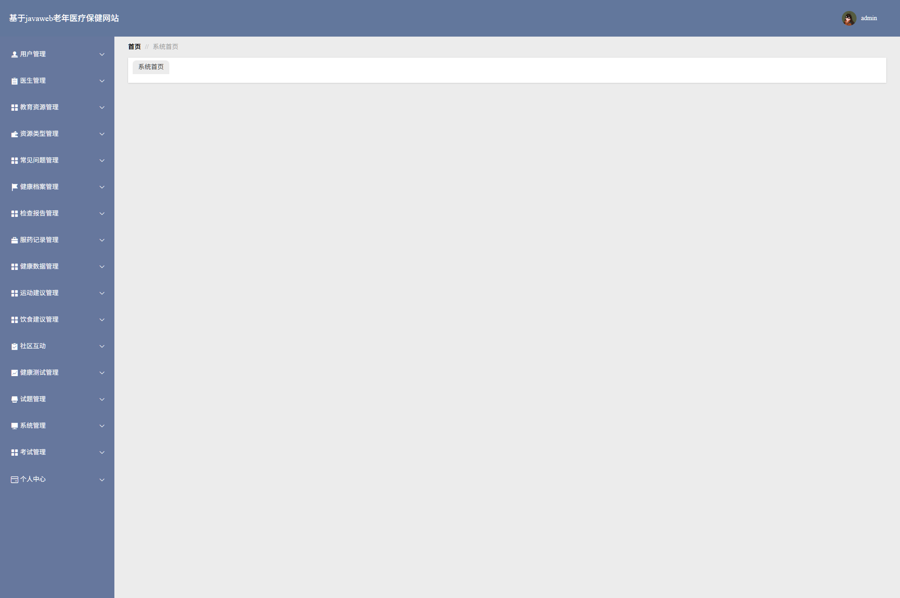
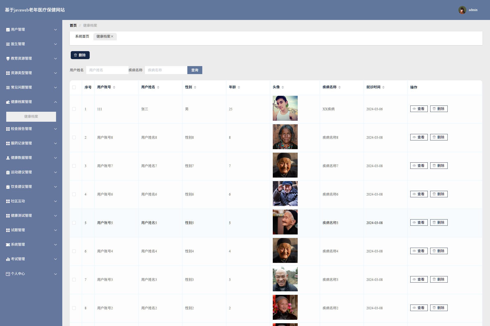

## 🌟 项目简介

这是一个基于 **Java + SpringBoot + Vue + MySQL** 构建的完整老年医疗保健网站，功能持续优化中...

### 🧩 功能模块一览

- 用户登录 / 注册（用户 / 医生双角色）
- 用户管理
- 医生管理
- 健康档案管理
- 健康数据管理
- 健康测试管理（试卷 / 试题 / 考试记录）
- 检查报告管理
- 服药记录管理
- 在线问诊
- 在线预约
- 照护指导
- 饮食建议 / 运动建议
- 教育资源管理（资源类型）
- 健康资讯（资讯分类）
- 社区互动（论坛）
- 收藏管理
- 常见问题
- 其它...

### 🖼️ 界面预览

|  |  |  |
|--------------------------|--------------------------|--------------------------|
|  |  |  |

---

## ⚙️ 运行环境与工具要求

为了确保项目顺利运行，请确认您的开发环境满足以下条件：

### ✅ 推荐配置
- **Java**: JDK 1.8  
- **MySQL**: 8.0.41  
- **Node.js**: 16.20.2  

⚠️ *温馨提示：版本不一致可能导致依赖冲突或启动失败。*

### 🛠️ 开发工具推荐
- **后端开发**: IntelliJ IDEA 2022+  
- **前端开发**: VS Code  
- **数据库管理**: Navicat / DBeaver / MySQL Workbench  ...

---

## 📥 项目更新下载地址

本项目会持续更新，更新后的完整包优先同步到这里，建议保存备用：

下载地址：[https://pan.xunlei.com/s/VP1p_htbdhpjdOa_TTE6B-ixA1?pwd=ende#](https://pan.xunlei.com/s/VP1p_htbdhpjdOa_TTE6B-ixA1?pwd=ende#)

提取码：`ende`

> 链接失效或需要最新版本：通过微信公众号 **【斯内普的数字坩埚】** 获取。

---

## 📲 获取更多帮助和服务

### 🔍 联系我们
关注公众号【斯内普的数字坩埚】即可获取：

- 其它免费的项目程序  
- 远程部署服务和讲解  
- 定制、二开、UI优化
- 微信/QQ 联系方式  

📷 扫码关注👇  

---

